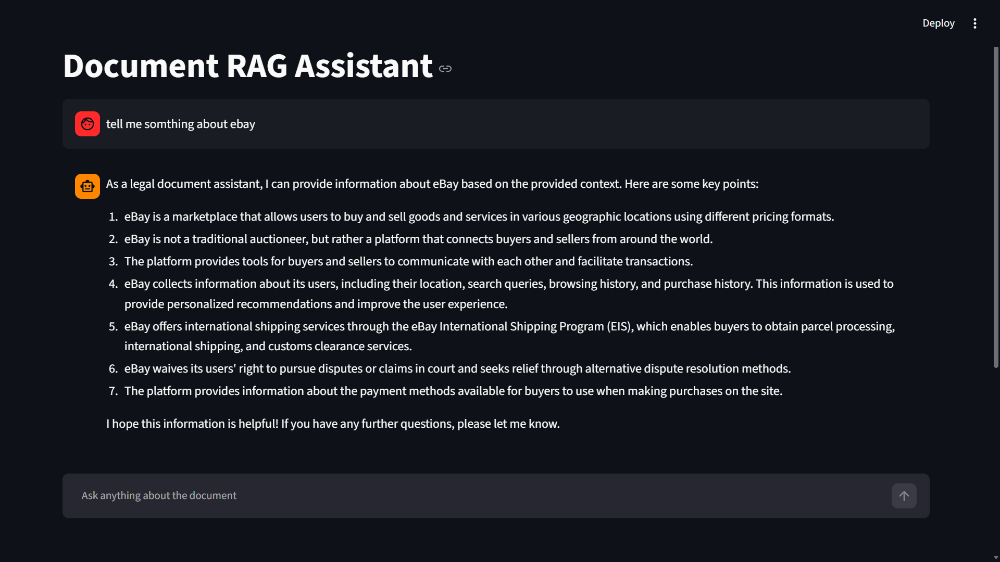

Fine-Tuned-RAG-Chatbot-with-Streaming-Responses

# 🤖 Fine-Tuned RAG Chatbot with Streaming Responses

A Retrieval-Augmented Generation (RAG) chatbot built using **LangChain**, **ChromaDB**, **Ollama**, and **Streamlit**. The chatbot retrieves relevant information from uploaded documents, augments the user query with retrieved context, and generates accurate responses using a Large Language Model with streaming output.

---

## 📷 Project Demo



---

# 🚀 Features

- 📄 PDF document ingestion
- ✂️ Intelligent document chunking
- 🧹 Text cleaning and preprocessing
- 🔍 Semantic search using embeddings
- 🗂 ChromaDB vector database
- 🤖 Local LLM support via Ollama
- ⚡ Streaming responses
- 💬 Interactive Streamlit interface
- 🧠 Retrieval-Augmented Generation (RAG)
- Modular and easy-to-understand code structure

---

# 🛠 Tech Stack

| Technology | Purpose |
|------------|---------|
| Python | Backend |
| Streamlit | Web UI |
| LangChain | RAG Pipeline |
| Ollama | Local LLM |
| ChromaDB | Vector Database |
| HuggingFace Embeddings | Text Embeddings |
| PyPDF | PDF Loading |

---

# 📂 Project Structure

```
Fine-Tuned-RAG-Chatbot-with-Streaming-Responses/
│
├── app.py                         # Streamlit Application
├── requirements.txt
├── README.md
│
├── data/
│   ├── AI_Training_Document.pdf
│   └── img.png
│
└── src/
    ├── config.py
    │
    ├── ingestion/
    │   ├── loader.py
    │   ├── cleaner.py
    │   ├── chunker.py
    │   └── __init__.py
    │
    ├── embeddings/
    │   └── embedder.py
    │
    ├── vectordb/
    │   ├── build_vectordb.py
    │   └── db_manager.py
    │
    ├── retriever/
    │   └── retriever.py
    │
    ├── prompts/
    │   └── prompt_templaate.py
    │
    ├── llm/
    │   └── models.py
    │
    └── pipeline/
        └── rag_pipeline.py
```

---

# ⚙️ Installation

## 1. Clone the Repository

```bash
git clone https://github.com/yourusername/Fine-Tuned-RAG-Chatbot-with-Streaming-Responses.git

cd Fine-Tuned-RAG-Chatbot-with-Streaming-Responses
```

---

## 2. Create Virtual Environment

### Windows

```bash
python -m venv venv

venv\Scripts\activate
```

### Linux / Mac

```bash
python3 -m venv venv

source venv/bin/activate
```

---

## 3. Install Dependencies

```bash
pip install -r requirements.txt
```

---

## 4. Install Ollama

Download:

https://ollama.com/download

---

## 5. Pull the Required Model

Example:

```bash
ollama pull mistral
```

or

```bash
ollama pull llama3
```

Update the model name inside:

```
src/llm/models.py
```

---

## 6. Build the Vector Database

```bash
python src/vectordb/build_vectordb.py
```

This script:

- Loads PDF documents
- Cleans the text
- Splits into chunks
- Generates embeddings
- Stores vectors in ChromaDB

---

## 7. Run the Streamlit App

```bash
streamlit run app.py
```

Open:

```
http://localhost:8501
```

---

# 🔄 RAG Workflow

```
PDF Documents
       │
       ▼
Document Loader
       │
       ▼
Text Cleaning
       │
       ▼
Chunking
       │
       ▼
Embedding Model
       │
       ▼
ChromaDB
       │
       ▼
Retriever
       │
       ▼
Prompt Template
       │
       ▼
Ollama LLM
       │
       ▼
Streaming Response
```

---

# 📌 How It Works

1. User uploads or provides PDF documents.
2. Documents are cleaned and split into smaller chunks.
3. Each chunk is converted into vector embeddings.
4. Embeddings are stored in ChromaDB.
5. User asks a question.
6. Retriever finds the most relevant document chunks.
7. Retrieved context is added to the prompt.
8. Ollama generates the final answer.
9. The answer is streamed back to the user.

---

# ▶️ Example Questions

- What is Artificial Intelligence?
- Explain Machine Learning.
- What is Deep Learning?
- Summarize the uploaded document.
- What are the applications of AI?

---

# 📦 Requirements

Some important packages used:

- streamlit
- langchain
- chromadb
- sentence-transformers
- ollama
- pypdf
- langchain-community
- langchain-core

Install everything using:

```bash
pip install -r requirements.txt
```

---

# 🎯 Future Improvements

- Multiple document upload
- Chat history
- Authentication
- Hybrid search
- Metadata filtering
- FAISS support
- OpenAI/Groq API integration
- Conversation memory
- Docker deployment
- Cloud deployment

---

# 👨‍💻 Author

**Dhruv**

B.Tech in Artificial Intelligence & Data Science

Machine Learning | Generative AI | RAG | LLM Applications

GitHub: https://github.com/Dhru007

---

# 📄 License

This project is licensed under the MIT License.

---

## ⭐ If you found this project useful, consider giving it a Star on GitHub!


